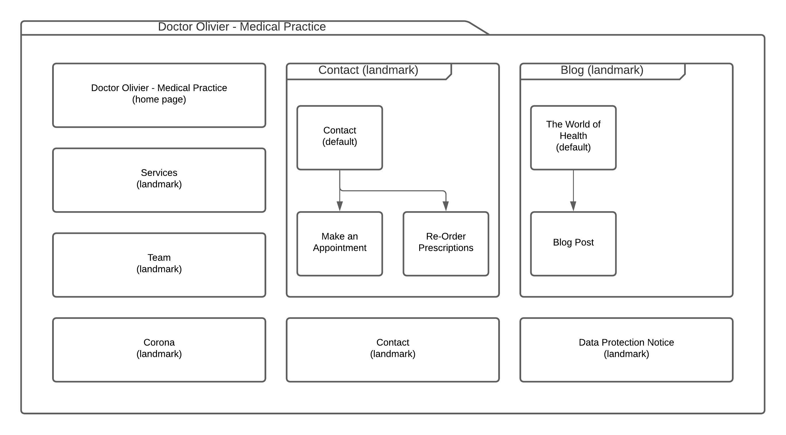

# Doctor Olivier &ndash; Medical Practice

## Business Description

Dr. med. Corey B. Olivier is an experienced general practitioner situated in Bridlington, England. Within his visiting times and during appointments, he performs examinations on his patients, gives diagnosis, issues referrals and writes new prescriptions or repeats existing ones. In addition, appointments for vaccines can be made at our practice. Dr. Olivier is supported by a small team of staff members which handle most of the logistics regarding questions, appointments and patient data. 

## Website Requirements

Due to the increasing number of patients and workload, we are looking for a new website that provides information about the practice to our patients and handles some of the more repetitive tasks for the convenience of both us and our patients. We would like to list not only the opening hours and services of our practice, but also introduce our team and provide information regarding the current state of the pandemic. Two main self-serve services that should be featured on the website are an online appointment booker, thus eliminating the need for repeating phone calls, as well as online prescription ordering for repeat-prescriptions which are then to be sent by mail by us. In addition, Dr. Olivier would like to have a space to write a blog informing patients about general health-best-practices as well as spreading awareness of unterestimated diseases and risks.

The title of the website should be "Doctor Olivier &ndash; Medical Practice" and it should be reachable at the domain "doctor-olivier.uk". A general diagram of the website design is the following:

<!-- TODO: Fabian -->

The information about each page are written down in the `sites` folder.

<!-- TODO: Fabian -->
How should the page look and file like:
- Clean
- Professional

For the colors: Please use the dark and light background color as brand color from doctor-olivier.jpg
Also a cool gray instead of a warm gray would be best. Because this looks cleaner.

Except the home page the layout should be the following:
- Navigation bar at the top
- Header with image of the doctor and important information such as opening hours, location and contact data
- Main Content
- Footer with links to other pages like:
    - Corona
    - Data Protection Notice
    - ...
- Copyright Notice

Fonts:
Professional and type sans

5. Also provide general requirements of how the website should look and feel (colors, fonts, layout, decorative elements, etc.)
=> 
