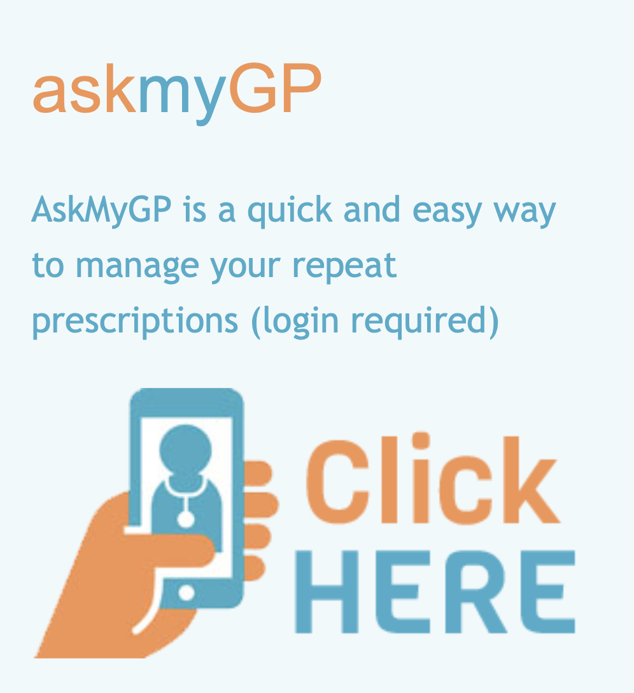

|          |                                                           |
|----------|-----------------------------------------------------------|
| filename | contact.html                                              |
| title    | Contact Us                                                |
| source   | https://www.boroughlochmedicalpractice.com/appointments2/ |
------------------------------------------------------------------------

The "Contact Us" page should allow patients and those interested in registering with our practice to find out how to get in touch with us. It should show the opening hours, address, an online contact-formular (the contents of which will be sent to us by E-Mail if submitted; our back-end provider will take care of this, for now you can concentrate on just the design), and a number to contact us outside of the office hours. It could have the following structure and content:

> Address: Ross Gardens 43, Edinburgh, EH9 3BP  
> Email: team@doctor-olivier.uk  
> Phone: +44 131 229 0000
>
> **Opening Hours**
>
> |Weekday  | Opening Time                            |
> |---------|-----------------------------------------|
> |Monday   | 07:00 - 10:00 AM                        |
> |Tuesday  | 07:00 - 10:00 AM &amp; 01:00 - 05:00 PM |
> |Wednesday| *appointments given by doctor only*     |
> |Thursday | 07:00 - 10:00 AM &amp; 01:00 - 05:00 PM |
> |Friday   | 07:00 - 10:00 AM                        |
> |Saturday | *closed*                                |
> |Sunday   | *closed*                                |
> *We are also open for you if you have an appointment with us.*
>
> Outside of the office hours NHS 24 ( Tel 111 ) can be reached for emergencies!  
> IF YOUR CONDITION IS LIFE THREATENING, please dial 999!
>
>
> In addition, Dr. Olivier can also be contacted using the AskmyGP appointment booking system. This service is available to all our patients, 24 hours a day. AskmyGP is simple and straightforward.
> **We are encouraging everyone who has access to a computer, smart phone or tablet to use AskMyGP!**

It should be possible to click our AskMyGP link (https://my.askmygp.uk/?c=S71379) from somewhere within the last paragraph, or a corresponding image / box. A corresponding image / box could be, for instance:
   
*(Image source: https://www.boroughlochmedicalpractice.com/appointments2/)*

Finally, the online contact formular should include the following fields, so we can keep up correspondence with patients writing to us this way:
- Name
- Email
- Phone (Optional)
- Subject
- Message
