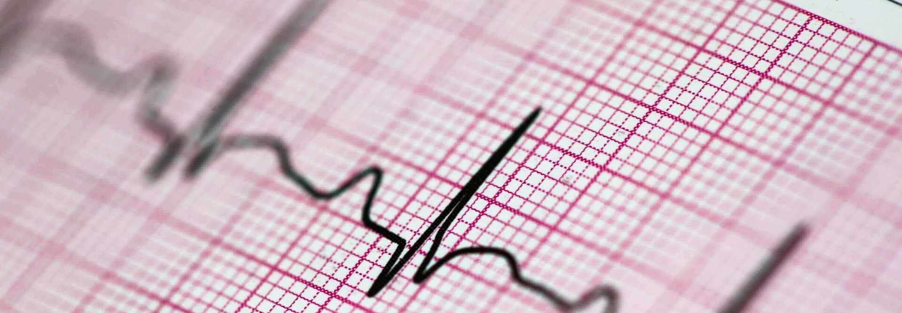
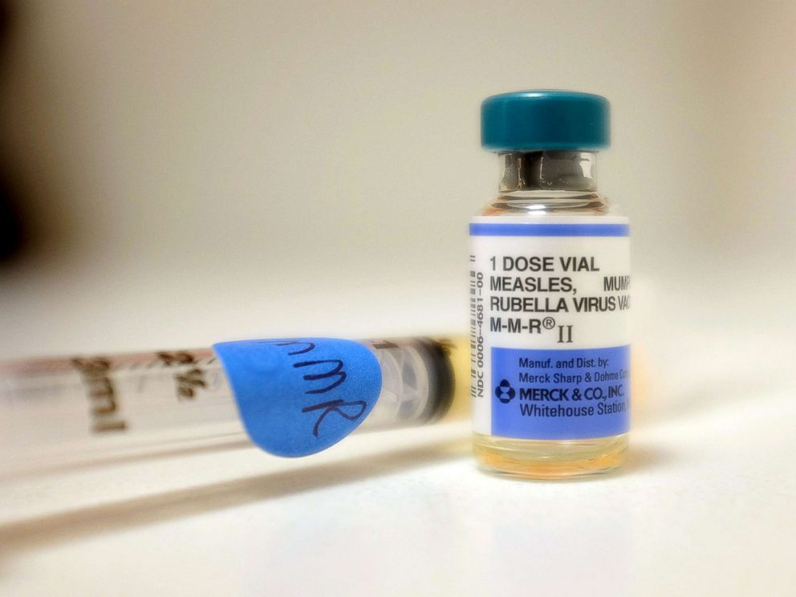
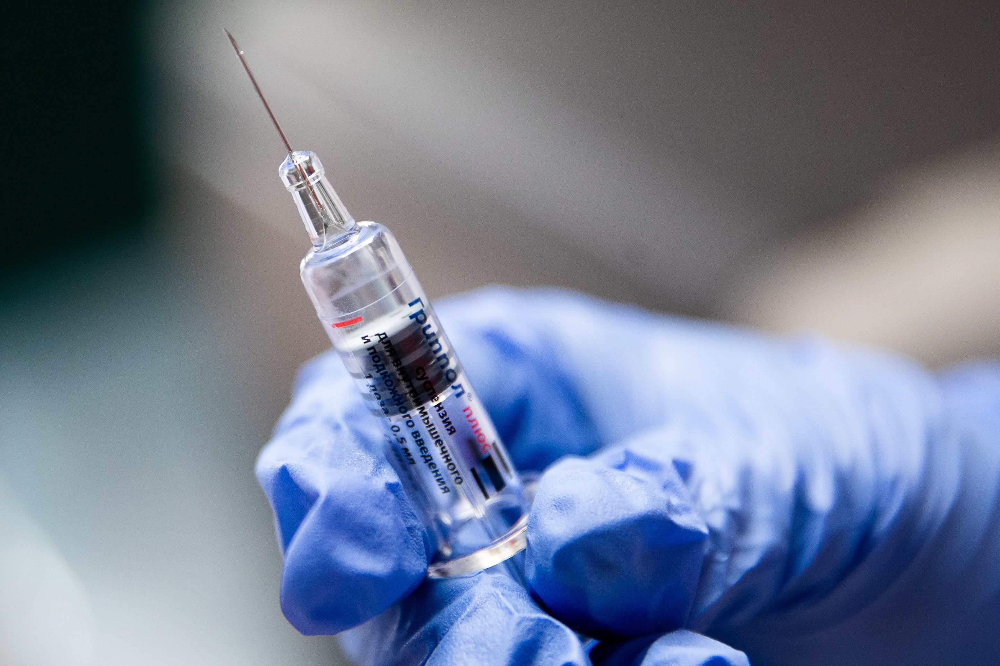
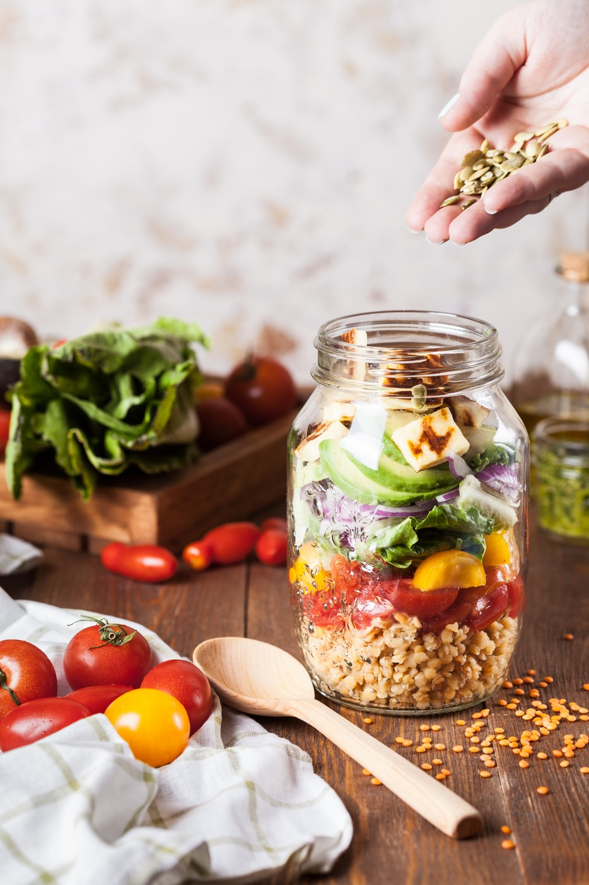
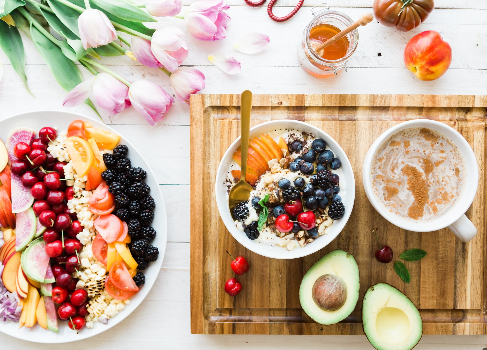
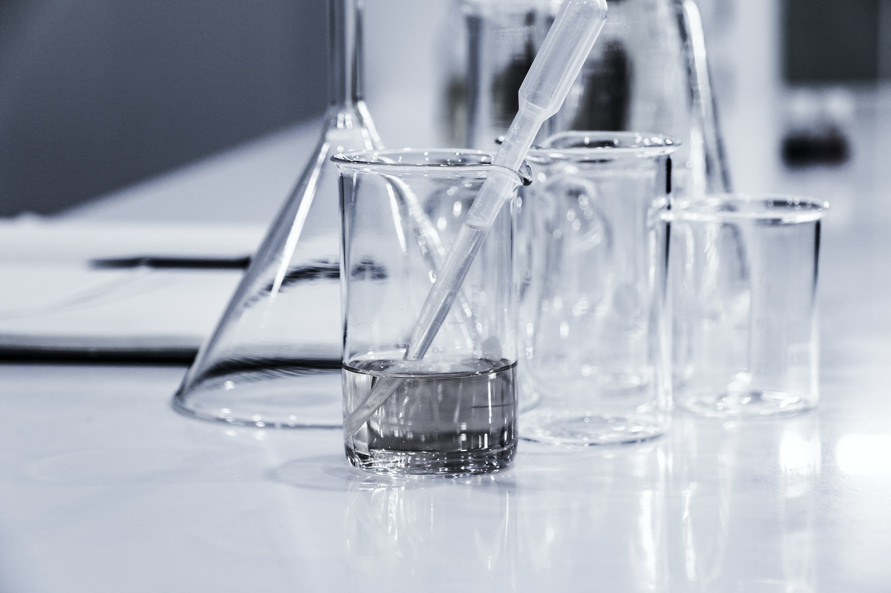
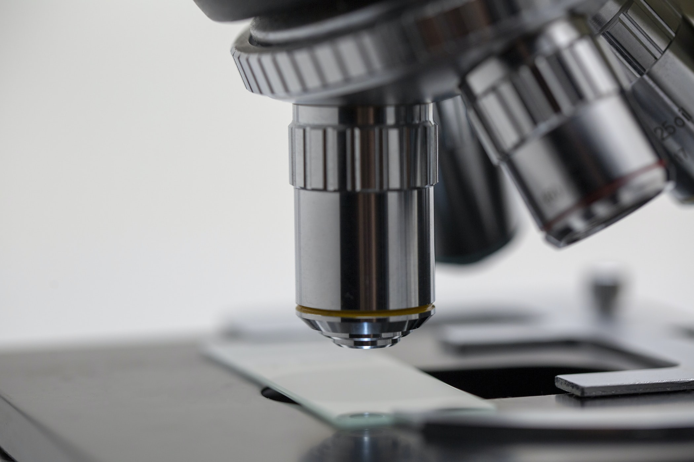

|          |                                      |
|----------|--------------------------------------|
| filename | services.html                        |
| title    | Our Services                         |
| *source* | https://www.dr-reutter.de/Leistungen |
---------------------------------------------------

This page should give our patients (and those interested in registering with us) an overview of the services we provide. These are to be scheduled by contacting us through the means given in the Contact Us area. The page should have the following contents:

> - **General practitioner care including home visits**
> - **Basic psychosomatic care**
> - **Nutritional advice**
> - **Vaccination advice / vaccinations**
> - **Prevention:**
>     - Health check-up (check up 35)
>     - Youth health examination
>     - Skin Cancer Screening Examination
>     - Men cancer screening examination
> 
> **Diagnostics, therapy and advice** as well as ongoing care and support in the sense of a first point of contact for all health questions and problems.
> 
> In addition to a thorough physical examination, we offer you the following examinations:
> - Ultrasound examination of the abdominal organs and thyroid gland
> - EKG
> - Exercise ECG
> - Long-term blood pressure measurement
> - Pulmonary function test
> - Urine and blood tests
> - Smear diagnostics (nose and throat, ears, wounds, oral mucosa, etc.)
> - Tissue samples from the body surface
> 
> We also provide care in retirement homes, nursing homes and short-term care.
> As part of our medical obligation, we refer you, if necessary, to specialists, clinics, rehabilitation centers and other therapy options such as B. Continue cure.
> 
> **Structured treatment programs (DMP):**
> - Type 2 diabetes mellitus
> - Bronchial asthma / COPD
> - Coronary heart disease
> 
> **Patient training:**
> - Bronchial asthma / COPD
> - High blood pressure / CHD
> - Smoking cessation courses
> - Group weight loss courses

The following images can be used to illustrate some of our services (however, we encourage you to use your own images in case you think they suit the website better):

| Usage example       | Source                                                                                                                                                                                                     | Image                                     |
|---------------------|------------------------------------------------------------------------------------------------------------------------------------------------------------------------------------------------------------|-------------------------------------------|
| EKG                 | https://www.londondoctorsclinic.co.uk/wp-content/uploads/2018/05/istock-182424105-3-min-min-2-2-2-2-2-3.jpg                                                                                                |                  |
| Vaccine (Alt. 1)    | https://s.abcnews.com/images/US/measles-vaccine-gty-jt-180115_4x3_992.jpg                                                                                                                                  |       |
| Vaccine (Alt. 2)    | https://s.yimg.com/uu/api/res/1.2/4Jf9T2SAcST443YA0nlEhg--~B/aD0yMDc2O3c9MzExNjtzbT0xO2FwcGlkPXl0YWNoeW9u/http://media.zenfs.com/en/homerun/feed_manager_auto_publish_494/1497c6ffd374850a9917da030ccd655e |       |
| Nutritions (Alt. 1) | Not required (Unsplash)                                                                                                                                                                                    |  |
| Nutritions (Alt. 1) | Not required (Unsplash)                                                                                                                                                                                    |  |
| Lab Utils (Alt. 1)  | Not required (Unsplash)                                                                                                                                                                                    |   |
| Lab Utils (Alt. 2)  | Not required (Unsplash)                                                                                                                                                                                    |   | 
