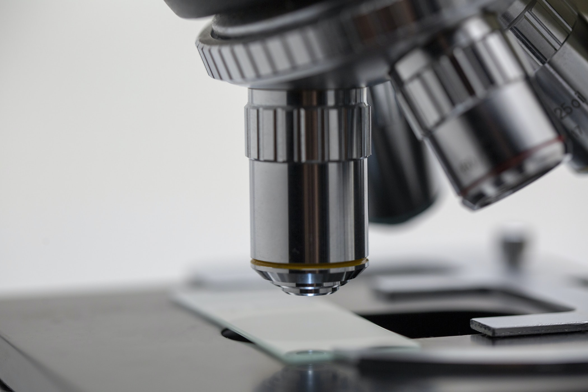

filename: services.html  
title: Our Services

used sources:
- https://www.dr-reutter.de/Leistungen

content:

Monday: 07:00 - 10:00  
Tuesday: 07:00 - 10:00 &amp; 13:00 - 17:00  
Wednesday: only appointments  
Thursday: 07:00 - 10:00 &amp; 13:00 - 17:00  
Friday: 07:00 - 10:00  
Saturday: closed  
Sunday: closed

we are also open for you if you have an appointment with us.

Outside of the office hours NHS 24 ( Tel 111 ) can be reached for emergencies!

IF YOUR CONDITION IS LIFE THREATENING, please dial 999

Our Services

- **General practitioner care including home visits**
- **Basic psychosomatic care**
- **Nutritional advice**
- **Vaccination advice / vaccinations**
- **Prevention:**
    - Health check-up (check up 35)
    - Youth health examination
    - Skin Cancer Screening Examination
    - Men cancer screening examination

**Diagnostics, therapy and advice** as well as ongoing care and support in the sense of a first point of contact for all health questions and problems.

In addition to a thorough physical examination, we offer you the following examinations:
- Ultrasound examination of the abdominal organs and thyroid gland
- EKG
- Exercise ECG
- Long-term blood pressure measurement
- Pulmonary function test
- Urine and blood tests
- Smear diagnostics (nose and throat, ears, wounds, oral mucosa, etc.)
- Tissue samples from the body surface

We also provide care in retirement homes, nursing homes and short-term care.
As part of our medical obligation, we refer you, if necessary, to specialists, clinics, rehabilitation centers and other therapy options such as B. Continue cure.

**Structured treatment programs (DMP):**
- Type 2 diabetes mellitus
- Bronchial asthma / COPD
- Coronary heart disease

**Patient training:**
- Bronchial asthma / COPD
- High blood pressure / CHD
- Smoking cessation courses
- Group weight loss courses

images:

